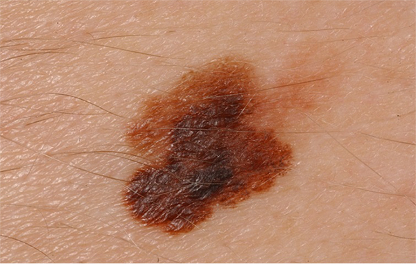
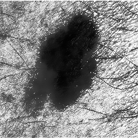
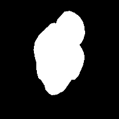
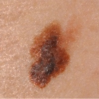
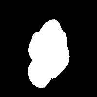
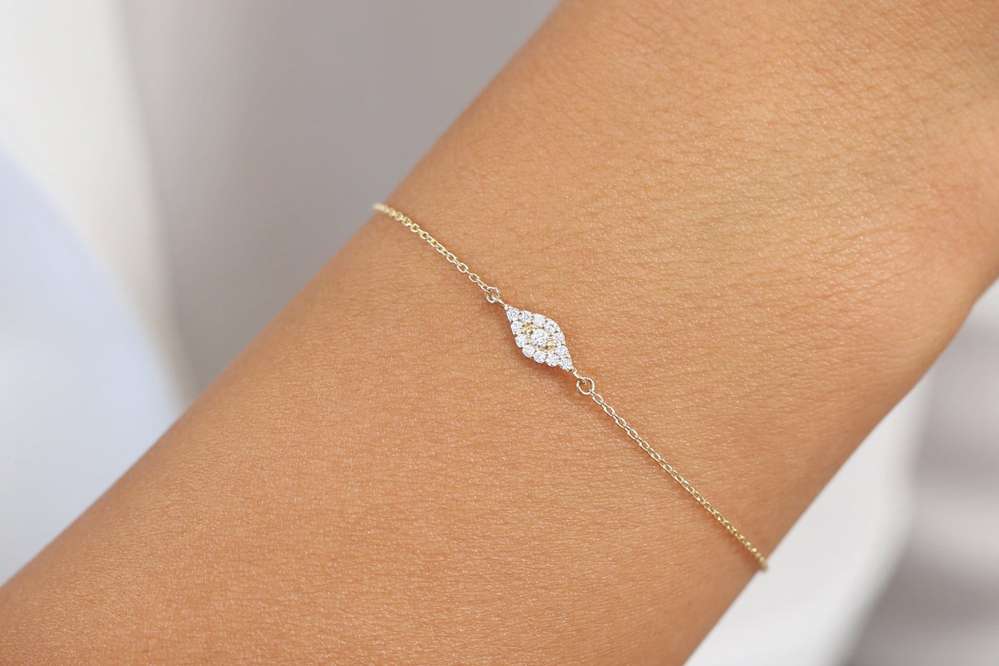
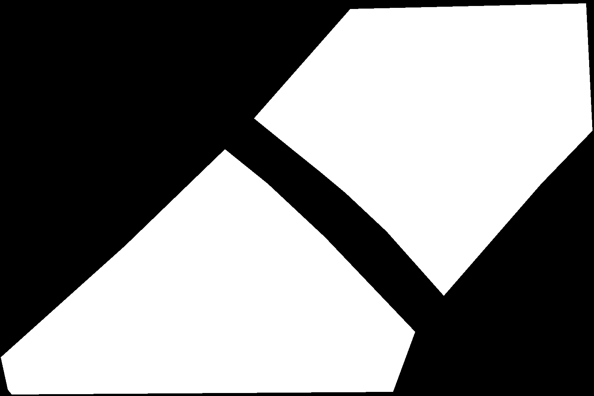
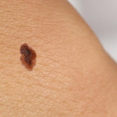
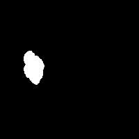

## Moles Detective: Data Augmentations & preprocessing
This is the Data Backend of MolesDetective Project,  
In this part of the project we created augmentation and image preprocess flow  
that will makes more learning samples, and will make our small datasets to be more balanced.  

###**Usage**:
1. Download the source code from github
2. In data_creation.py script, chose between the enums ['training_data', 'fake_data'],
   set input and output directories paths.
3. modify params.py as you desire (augmentation activation + paths setting).
4. execute data_creation.py.
5. all artifacts, masks and images after flipping/rotation and other augmentations
   will be generated in output_dir path.

**Augmentations & Preprocesses**:
- Flip
- Rotation
- Fake Image Creation
- Random Resize and Crop
- Crop
- Balanced labels artifacts augmentation
- colors threshold
- image blending(binary wise-operation + fixing boundaries, laplacian)
- hair removal

**Example**:  
Real Data Augmentation: (without image blending on synthetic data)

| Preprocess | `Image` |  `Mask` |
| :---: | :---: | :---: |
| Original | |  |
| Random Crop & Flip |   |  |
|  Equalize Histogram & Greyscale |   |  |
|  Hair Removal |  |  |

Fake Data Augmentation:  
(image blending between Object image + mask into Template Object + Mask)

| Fake Augmentation | `Image` |  `Mask` |
| :---: | :---: | :---: |
| Object To Transplant | |  |
| Placeholder Template | |  |
| Augmented Result| |  |

As you can see, the object transplanted with a chosen technique of  
image blending into a randomly chosen area in the template image.

